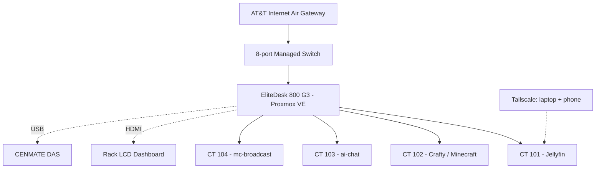
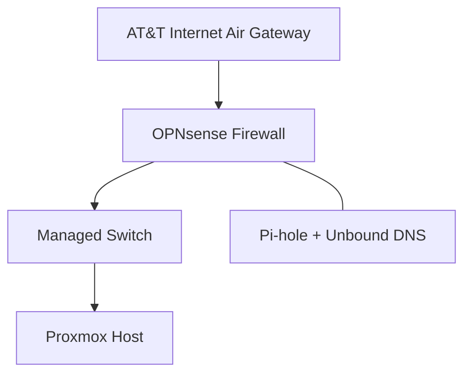

# Network Topology

## Current

```mermaid
graph TD
    ISP[AT&T Internet Air Gateway] --> SW[8-port Managed Switch]
    SW --> PVE[EliteDesk 800 G3 - Proxmox VE]
    PVE --> JF[CT 101 - Jellyfin]
    PVE --> MC[CT 102 - Crafty / Minecraft]
    PVE --> AI[CT 103 - ai-chat]
    PVE --> MB[CT 104 - mc-broadcast]
    PVE -. HDMI .-> LCD[Rack LCD Dashboard]
    PVE -. USB .-> DAS[CENMATE DAS]
    TS[Tailscale: laptop + phone] -.-> JF
```

## Planned

```mermaid
graph TD
    ISP[AT&T Internet Air Gateway] --> FW[OPNsense Firewall]
    FW --> SW[Managed Switch]
    SW --> PVE[Proxmox Host]
    FW --- DNS[Pi-hole + Unbound DNS]
```
