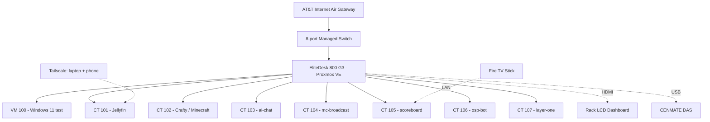
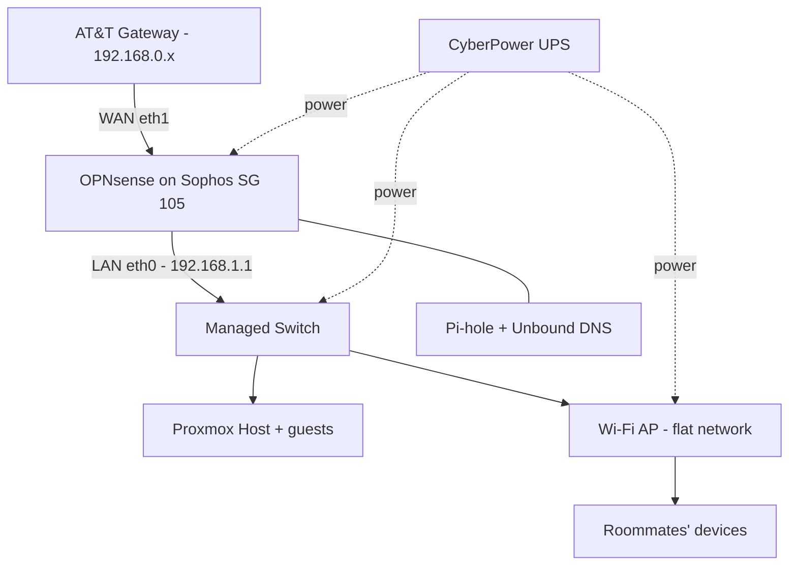

# Network Topology

## Current

```mermaid
graph TD
    ISP[AT&T Internet Air Gateway] --> SW[8-port Managed Switch]
    SW --> PVE[EliteDesk 800 G3 - Proxmox VE]
    PVE --> VM[VM 100 - Windows 11 test]
    PVE --> JF[CT 101 - Jellyfin]
    PVE --> MC[CT 102 - Crafty / Minecraft]
    PVE --> AI[CT 103 - ai-chat]
    PVE --> MB[CT 104 - mc-broadcast]
    PVE --> SB[CT 105 - scoreboard]
    PVE --> OSP[CT 106 - osp-bot]
    PVE --> L1[CT 107 - layer-one]
    PVE -. HDMI .-> LCD[Rack LCD Dashboard]
    PVE -. USB .-> DAS[CENMATE DAS]
    FTV[Fire TV Stick] -. LAN .-> SB
    TS[Tailscale: laptop + phone] -.-> JF
```

## Planned (after firewall cutover)

```mermaid
graph TD
    ISP[AT&T Gateway - 192.168.0.x] -->|WAN eth1| FW[OPNsense on Sophos SG 105]
    FW -->|LAN eth0 - 192.168.1.1| SW[Managed Switch]
    SW --> PVE[Proxmox Host + guests]
    SW --> AP[Wi-Fi AP - flat network]
    AP --> CL[Roommates' devices]
    FW --- DNS[Pi-hole + Unbound DNS]
    UPS[CyberPower UPS] -. power .-> FW
    UPS -. power .-> SW
    UPS -. power .-> AP
```
